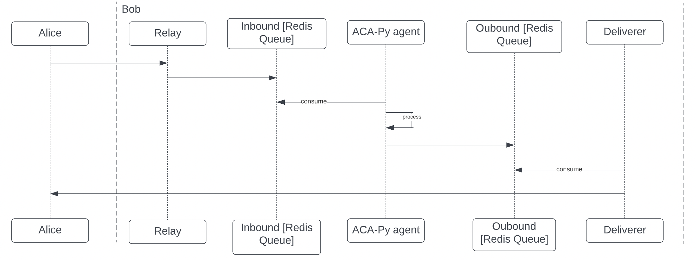
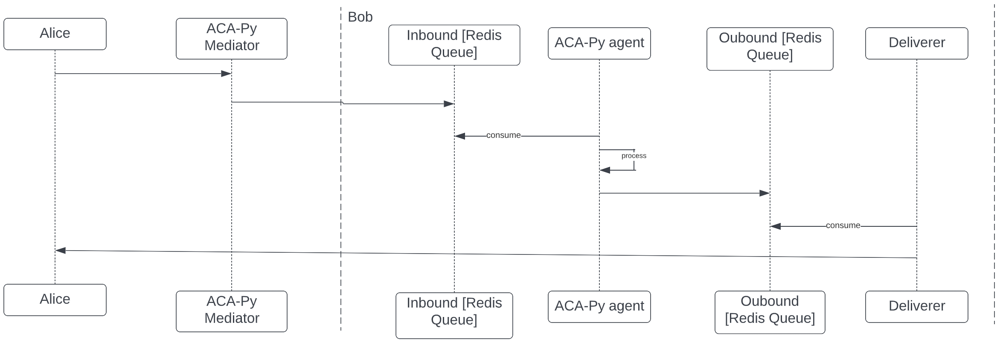
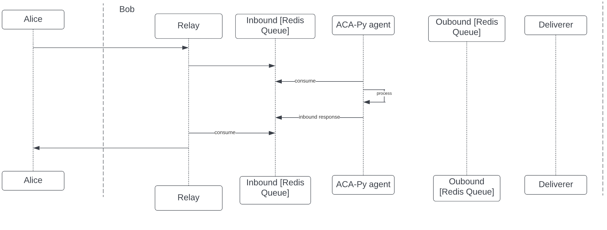

# ACA-PY Redis Queue Plugin

```
│    
│
└───deliverer
│   __init__.py
│   deliver.py
└───redis_queue
│   └───events
│   inbound
│   outbound
└───relay
│   __init__.py
|
|
```


#### With Relay


#### With Mediator


#### With Relay [direct_reponse] 


## Installation and Usage

First, install this plugin into your environment.

```sh
$ pip install git+https://github.com/bcgov/aries-acapy-plugin-redis-events.git
```

When starting up ACA-Py, load the plugin along with any other startup
parameters.

```sh
$ aca-py start --arg-file my_config.yml --plugin redis_queue
```

## Plugin configuration
```yaml
redis_queue:
  connection: 
    connection_url: "redis_test_url"

  ### For Inbound ###
  inbound:
    acapy_inbound_topic: "acapy-inbound-message"
    acapy_direct_resp_topic: "acapy-inbound-direct-resp"

  ### For Outbound ###
  outbound:
    acapy_outbound_topic: "acapy-outbound-message"
    acapy_outbound_retry_topic: "acapy-outbound-retry"

  ### For Event ###
  event:
    topic_maps:
      ^acapy::webhook::(.*)$: acapy-webhook-$wallet_id
      ^acapy::record::([^:]*)::([^:]*)$: acapy-record-with-state-$wallet_id
      ^acapy::record::([^:])?: acapy-record-$wallet_id
      acapy::basicmessage::.*: acapy-basicmessage
```
## Plugin deployment
Once the plugin config is filled up. It is possible to deploy the plugin inside ACA-Py.
```shell
$ aca-py start \
    --plugin redis_queue \
    --plugin-config plugins-config.yaml \
    -it redis_queue.v1_0.inbound redis 0 -oq redis_queue.v1_0.outbound
    # ... the remainder of your startup arguments
```
