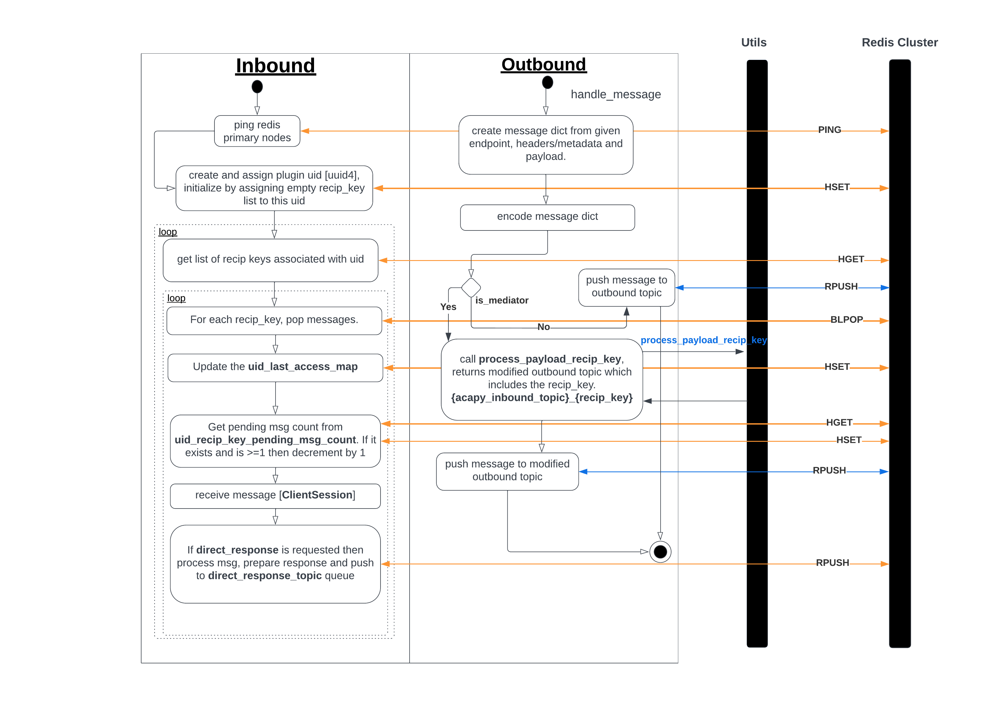
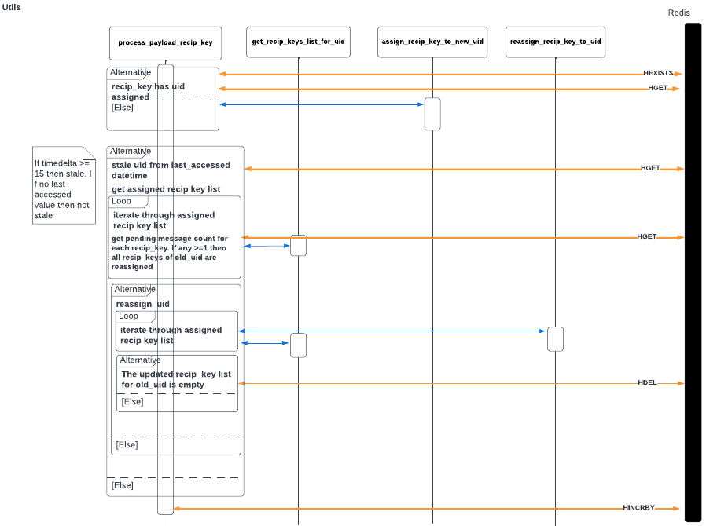

# ACA-Py Redis Plugin Design [Sharding]

## Redis Datastructures
- <b>`uid_recip_key_pending_msg_count`</b> Key `{uid}_{recip_key}` Value `int, number of pending messages`
- <b>`round_robin_iterator`</b> 
Returns next iterator which is used as an index to get a new plugin uid from `uid_recip_keys_map` [getting list of uid by `HKEYS`]
- <b>`uid_recip_keys_map`</b> Key `{uid}` Value `list, list of assigned recipient keys`
- <b>`recip_key_uid_map`</b> Key `{recip_key}` Value `assigned plugin uid`
- <b>`uid_last_access_map`</b> Key `{uid}` Value `str, datetime when this uid was last accessed/updates`

## Design

 
 
Core logic for plugin uid assignment in `relay` is same as when using `outbound [is_mediator: true]`, that is, it calls the `process_payload_recip_key` function in `utils` to get the required topic [`{acapy_inbound_topic}_{recip_key}`].
 
 

### Utils Sequence Diagram

 

#### `process_payload_recip_key`
- get recipient_key from message
- check if the recip_key has a plugin_uid assigned to it. If it doesn't, then call `assign_recip_key_to_new_uid` which returns the newly assigned plugin uid.
- get the last accessed datetime for the plugin uid. If the last accessed value does not exists then uid is not considered as stale. If last accessed value exists and timedelta from current is more than 15 seconds then the uid is considered stale and need to further checked for reassignment.
- If state, we extract recip_keys list assgined to old/stale uid. For each of the recip key in list, we get pending msg count for each [`{old_uid}_{recip_key}` key in `uid_recip_key_pending_msg_count`]. In case, any of these satisfy `pending_msg_count>=1` then we reassign the old_uid.
- For reassignemtn, we iterate through the all the recip_keys assigned to old uid by calling `reassign_recip_key_to_uid`. Then after reassignment we retrieve recip_key list associated with old uid and check if the length is 0. If it is then we delete the old uid from `uid_recip_keys_map`
- Increment the `pending_msg_count` for the `{new_uid}_{recip_key}` key in `uid_recip_key_pending_msg_count` by 1

#### `get_new_valid_uid`
- get iterator/index from `round_robin_iterator`
- if iterator does not exists then set `round_robin_iterator` to 0
- get list of available uid, calling `HKEYS` command on `uid_recip_keys_map`
- use iterator as list index to grab the valid plugin uid
- increment the iterator by 1 unless `iterator + 1 > len(uid_list)` in which case this is reset to 0.

#### `assign_recip_key_to_new_uid`
- call `get_new_valid_uid` and get the uid
- assign recip_key to new uid
- add recip_key to the assigned recip_key list for the uid and update it in `uid_recip_keys_map`
- set `pending_msg_count` to 0

#### `reassign_recip_key_to_uid`
- get new uid
- get recip_key list associated with old uid, `old_recip_key_list`
- get recip_key list associated with new uid, `new_recip_key_list`
- remove recip_key from `old_recip_key_list` and update it in `uid_recip_keys_map`
- assign `{old_uid}_{recip_key}` key's value in `uid_recip_key_pending_msg_count` to a local variable and then proceed to delete it.
- assign new uid to recip_key in `recip_key_uid_map`
- add recip_key to `new_recip_key_list` and update it in `uid_recip_keys_map`
- If saved `old_pending_msg_count` is >= 1 then assign the same count against the new uid in `uid_recip_key_pending_msg_count`
